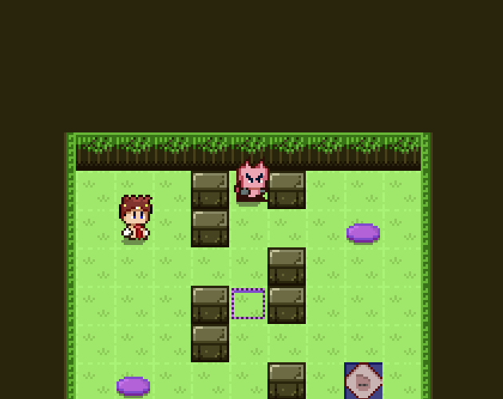

# Excalibatta

A small puzzle game built in Excalibur and React.  
This game is a Excalibur port of a React game called [Ciabattas Revenge](https://drewconley.itch.io/ciabattas-revenge)

The core game mechanic, concepts and assets are all based on the excellent tutorial series by Drew Conley.  
The tutorial series can be found here: https://courses.drewconley.dev/

## Play game

🕹️ [Play game](https://excalibatta.netlify.app/) 🕹️

Stack:

- [Excalibur](https://excaliburjs.com/)
- [TypeScript](https://www.typescriptlang.org/)
- [Vite](https://vitejs.dev/)
- [React](https://react.dev/)

**Note:** This version still uses React, but only for the UI

## Learning objective

This isn't a complete game. It was a prototype of how well Excalibur and React could play together.

## TODO

More levels and everything listed in the Github issue tracker.
